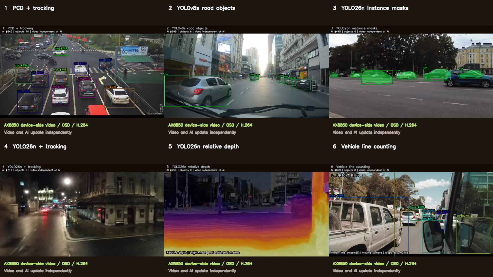
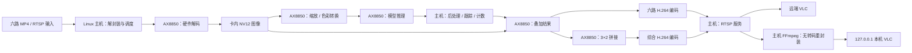

# AX8850 Multistream Demo

基于 AX8850 算力卡的六路道路视频 AI 示例：**硬件解码 → 模型推理 → 结果叠加 → H.264 编码 → RTSP 推流**。同时输出六路独立画面和一路 3×2 综合画面，支持开发板本机 VLC 预览。

项目包含程序源码、依赖源码快照、5 个 AXModel 模型、6 段输入视频、aarch64 预编译程序，以及编译、启动、测速和录像脚本。



*实际运行截图。第 3、4 路使用半速视频；综合画面不显示视频文件名。*

## 1. 查看六路功能

| 路数 / 名称 | 输入视频 | 模型与功能 | 视频配置帧率 |
|---|---|---|---:|
| 1 / `pcd` | `traffic.mp4` | PCD：行人、车辆、骑行目标检测与跟踪 | 12 FPS |
| 2 / `vehicle` | `traffic4.mp4` | YOLOv8s：道路目标检测 | 25 FPS |
| 3 / `seg` | `traffic3_slow_0p5x.mp4` | YOLO26n-Seg：实例分割 | 30 FPS |
| 4 / `driving` | `traffic7_slow_0p5x.mp4` | YOLO26n：道路目标检测与跟踪 | 29.97 FPS |
| 5 / `depth` | `traffic5.mp4` | YOLO26n-Depth：相对深度可视化 | 23.976 FPS |
| 6 / `count` | `traffic6.mp4` | YOLOv8s + ByteTrack：车辆跟踪与过线计数 | 24 FPS |
| 综合 / `overview` | 上述六路 | 3×2 拼接画面 | 30 FPS |

所有输入及编码输出均为 **1920×1080**，无音频。表中为视频输出的配置帧率；**AI 结果更新帧率单独统计**，不代表每一帧视频都进行了推理。

深度颜色表示相对远近，不能直接换算成米。第六路基于画面中的竖线统计跨线事件；移动相机、遮挡和视频循环都会影响计数，不等同于标定后的真实车流量。

## 2. 准备运行环境

以下命令在**安装算力卡的 Linux 主机**执行。已验证环境：DShanPi-A1 / RK3576、Ubuntu 24.04 aarch64、`6.1.115-vendor-rk35xx` 内核、AXCL 3.16.0、16GB AX8850 卡。测试详情见 [验证记录](docs/VALIDATION.md)。

### 2.1 确认算力卡可用

```bash
uname -m
lspci -nnk -d 1f4b:0650
sudo /usr/bin/axcl/axcl-smi
```

应能看到 `aarch64`、AXERA PCIe 设备以及 `axcl-smi` 中的 AX8850 卡、温度和内存信息。保持散热片和风扇工作。

首次安装主机环境时，先安装与主机架构、内核匹配的 AXCL 驱动及开发库，并部署与卡的容量、DDR 配置对应的 PAC。安装来源可参考 [16GB AXCL 包](https://huggingface.co/AXERA-TECH/AXCL/tree/main/V3.16.0_16G) / [8GB AXCL 包](https://huggingface.co/AXERA-TECH/AXCL/tree/main/V3.16.0_8G)。

主机驱动编译依赖**与 `uname -r` 完全匹配、可用于外部模块编译的内核 headers**。`apt` 显示包已解压不代表驱动配置成功；安装失败时查看 `/var/log/axclhost-install.log`。

首次部署随卡提供的配套 PAC，可执行：

```bash
# 在配套 PAC 所在目录执行，将 card-runtime.pac 换成实际文件名。
sudo install -D -m 0644 card-runtime.pac /lib/firmware/axcl/ax650_card.pac
sudo sync
sudo reboot
```

重启后再次执行 `axcl-smi`。PAC 保存在主机磁盘，由驱动加载；本项目不修改卡内 AXP 固件，也不附带 AXCL 驱动、PAC 或内核 headers。已能正常运行 `axcl-smi` 的主机可以直接继续。

### 2.2 安装示例依赖

```bash
sudo apt update
sudo apt install -y build-essential cmake pkg-config libopencv-dev \
  python3 ffmpeg util-linux
```

在开发板桌面使用本机预览时，再安装 VLC：

```bash
sudo apt install -y vlc
```

AXCL 开发文件应包含 `/usr/include/axcl/axcl.h` 和 `/usr/lib/axcl/libaxcl_rt.so`。项目使用 C++17、CMake ≥ 3.18；随包预编译程序依赖本次测试环境的 OpenCV 4.6（`.so.406`）。其他发行版优先按第 5 节重新编译。

## 3. 复制项目并启动

将整个项目复制到 Linux 主机，例如 `~/ax8850-multistream-demo`。保留 `models/`、`videos/`、`prebuilt/` 的目录结构。

```bash
cd ~/ax8850-multistream-demo
chmod +x ./*.sh tools/*.py prebuilt/linux-aarch64/bin/six_app
python3 tools/verify_assets.py
bash start.sh
```

校验时应显示 5 个模型、6 个视频全部 `OK`。启动后查看：

```bash
systemctl is-active ax8850-multistream ax8850-local-preview
sudo journalctl -u ax8850-multistream -f -o cat
```

两个服务应为 `active`。初始化后约每 10 秒打印一组 `"event":"stats"`，六路 `decoded`、`inferred`、`encoded` 持续增加。

`start.sh` 使用 systemd 临时服务，关闭 SSH 终端后继续运行，**重启主机后需重新启动**。默认使用设备 0，关闭 VNPU 切分。启动前应停止同一卡上已有的示例；脚本遇到 8554 或 8850 端口占用会报错。

停止或重新加载配置：

```bash
bash stop.sh
bash start.sh
```

前台调试可使用以下命令；先停止后台服务。`0` 表示持续运行，按 `Ctrl+C` 正常退出：

```bash
sudo bash run.sh configs/six.json 0
# 或只运行 60 秒
sudo bash run.sh configs/six.json 60
```

前台模式只启动 RTSP 程序。需要 HTTP 本机预览时，在另一个终端运行 `python3 tools/local_preview.py`。

## 4. 预览与录像

### 4.1 在其他电脑预览

VLC →「媒体」→「打开网络串流」，输入以下地址。将 `<主机IP>` 换成算力卡所在 Linux 主机的地址，例如 `192.168.1.44`。

| 画面 | RTSP 地址 |
|---|---|
| 综合画面 | `rtsp://<主机IP>:8554/overview` |
| 第 1 路 | `rtsp://<主机IP>:8554/pcd` |
| 第 2 路 | `rtsp://<主机IP>:8554/vehicle` |
| 第 3 路 | `rtsp://<主机IP>:8554/seg` |
| 第 4 路 | `rtsp://<主机IP>:8554/driving` |
| 第 5 路 | `rtsp://<主机IP>:8554/depth` |
| 第 6 路 | `rtsp://<主机IP>:8554/count` |

这些流用于本地演示网络，示例未配置 RTSP 访问认证。

### 4.2 在开发板 VLC 本机预览

在**开发板桌面的普通用户终端**执行，VLC 不使用 `sudo`：

```bash
cd ~/ax8850-multistream-demo
bash preview-local.sh             # 综合画面
bash preview-local.sh driving     # 第 4 路
```

也可以直接打开 `http://127.0.0.1:8850/overview.ts`，或加载 [本机播放列表](configs/local-preview.m3u)。

本次开发板上的 VLC 缺少可用的 RTSP 支持，因此提供 HTTP 预览入口。预览服务按需调用 FFmpeg，用 `-c:v copy` 将已有 H.264 码流重新封装为 MPEG-TS，**不做视频转码**。播放器显示画面的解码仍消耗主机资源。HTTP 服务只监听 `127.0.0.1`，其他电脑使用上一节的 RTSP 地址。

### 4.3 保存综合画面

```bash
bash record-overview.sh 60
```

请求录制 60 秒，文件保存到 `recordings/overview-日期-时间.mp4`。录像直接保存算力卡编码输出，不重新编码；复制码流从可解码的关键帧开始，实际片段时长可能略短。

## 5. 从源码编译

在 Linux 主机的项目根目录执行：

```bash
bash build.sh
```

默认使用两个编译任务，产物安装到项目内的 `build/install/`，不会安装到系统目录：

```text
build/install/
├── bin/six_app
└── lib/
    ├── libax_video_sdk.so
    └── plugins/
        ├── libax_plugin_pcd.so
        ├── libax_plugin_yolo26.so
        └── libax_plugin_yolov8_split.so
```

编译成功后，`run.sh` 自动优先使用 `build/install/`，其次使用 `prebuilt/linux-aarch64/`。无需修改配置中的插件路径。

AXCL 安装在其他位置时，可指定 SDK 根目录和运行库目录：

```bash
AXCL_ROOT=/opt/axcl JOBS=2 bash build.sh
sudo env AXCL_LIB_DIR=/opt/axcl/lib bash run.sh configs/six.json 60
```

源码及嵌套依赖已收集到 `vendor/`，无需再拉取 Git submodule。随包二进制仅面向 aarch64；其他主机架构需要对应 AXCL SDK 并重新编译，尚未按本项目配置验证。

## 6. 修改视频和配置

入口为 [configs/six.json](configs/six.json)，使用本示例的 `channels` 格式。它与原始 `ax_pipeline_app` 的 `system/pipelines` 配置格式不同。

| 字段 | 含义 |
|---|---|
| `output_fps` | 综合画面输出帧率，默认 30 |
| `overview` | 综合画面 RTSP 输出地址 |
| `channels[].input` | 项目内视频路径，或输入 RTSP 地址 |
| `channels[].source_fps` | 该路编码时间戳与输出帧率，应与准备好的输入视频匹配 |
| `channels[].kind` | 后处理分支：`pcd`、`vehicle`、`seg`、`depth`、`count` |
| `channels[].title` | 综合画面中的功能标题 |
| `channels[].model` | 模型路径 |
| `channels[].plugin` | 检测插件的文件名；分割和深度使用程序内的后处理 |
| `plugin_options` | 传给检测插件的参数，例如模型路径、阈值、类别数 |
| `channels[].enable_tracking` | 启用应用层跟踪；PCD 和 count 分支自动启用 |
| `channels[].line_x` | 第六路计数线横坐标，0～1，默认 0.4 |
| `channels[].line_deadband` | 计数线两侧的迟滞区，减少抖动重复计数 |
| `channels[].source_loop_us` | 第六路输入文件时长，单位微秒，用于循环边界重置跟踪状态 |

路径相对于项目根目录。启动时 `tools/prepare_config.py` 检查资源文件，生成带绝对路径的 `run/config.json`；日常修改模板 `configs/six.json` 即可。

当前实现固定六路、3×2 布局、1080p 输出。更换模型时，需要核对芯片目标、输入格式、输出张量和后处理；仅修改模型文件名并不能让任意 AXModel 通用运行。现有模型来源见 [models/README.md](models/README.md)。

### 6.1 检查并统一新视频

```bash
ffprobe -v error -select_streams v:0 \
  -show_entries stream=codec_name,width,height,avg_frame_rate:format=duration \
  -of json videos/new.mp4
```

需要转换时，保留原文件，生成 1080p、30 FPS、H.264 文件：

```bash
ffmpeg -i videos/new.mp4 -an \
  -vf "scale=1920:1080:force_original_aspect_ratio=decrease,pad=1920:1080:(ow-iw)/2:(oh-ih)/2,fps=30" \
  -c:v libx264 -preset fast -crf 20 -pix_fmt yuv420p \
  -movflags +faststart videos/new_1080p.mp4
```

然后修改该路 `input` 和 `source_fps`。第六路还应更新 `source_loop_us`。视频预处理由主机 FFmpeg 执行，与示例运行时的算力卡硬件编解码是两个阶段。

### 6.2 生成半速视频

已提供的第 3、4 路半速文件无需重复处理。其他视频要降为 0.5 倍速，可以生成新文件：

```bash
ffmpeg -i videos/new_1080p.mp4 -an \
  -vf "setpts=2*(PTS-STARTPTS),fps=30" \
  -c:v libx264 -preset fast -crf 20 -pix_fmt yuv420p \
  -movflags +faststart videos/new_slow_0p5x.mp4
```

此例保留 30 FPS 播放，时长约翻倍；只改 `source_fps` 不能替代输入视频的降速处理。

## 7. 查看架构与源码



**卡端执行**解码、模型输入图像处理、NPU 推理、图像叠加与拼接、H.264 编码。**主机执行**文件解封装、调度、模型输出后处理、ByteTrack、计数、标注图生成、RTSP 服务和播放器显示。

解码后的完整图像留在卡内。主机读取模型输出并生成较小的标注图，再上传到卡端合成，减少完整视频帧经过 PCIe 的次数；这一流程仍包含输入码流、输出张量、标注图和编码码流的传输。

每路分别运行推理线程和视频渲染线程。推理使用最新图像，渲染使用最近一次完成的结果，避免较慢模型拖慢整路视频播放。编码和渲染队列有长度上限；负载过高时会丢弃旧帧，以限制积压和延迟。

| 文件 / 目录 | 内容 |
|---|---|
| `src/six_app.cpp` | 六路调度、设备图像池、分割/深度后处理、跟踪计数、叠加、拼接、统计与退出 |
| `patches/npu/` | 当前使用的 AXCL 模型 runner，包含输出同步范围与耗时统计支持 |
| `vendor/ax-pipeline/` | AXERA 原始项目源码快照，包含模型插件、ByteTrack 和其他上游示例 |
| `vendor/ax-pipeline/deps/ax-video-sdk/` | AXCL 图像、解码、编码、输入与输出封装 |
| `vendor/ax-pipeline/deps/ax-video-sdk/third-party/rtsp-sdk/` | RTSP 协议实现与依赖 |
| `CMakeLists.txt`、`build.sh` | 本示例独立构建入口；只构建需要的程序和插件 |
| `configs/` | 六路配置与本机播放列表 |
| `models/`、`videos/` | 已配套的模型与输入视频 |
| `prebuilt/linux-aarch64/` | 配套的 aarch64 程序、视频 SDK 和模型插件 |
| `tools/` | 路径解析、资源校验、HTTP 预览、FPS 统计 |
| `provenance/` | 源码版本、资源 SHA256、原部署脚本等追溯记录 |
| `run/`、`logs/`、`recordings/` | 运行时生成的文件，不加入 Git |

`provenance/original-deployment/` 保留整理前的原始配置和脚本，其中含原开发板路径，仅用于追溯。运行本项目使用根目录的新脚本。

## 8. 检查帧率与运行状态

启动约 30 秒后执行：

```bash
sudo python3 tools/fps.py
sudo /usr/bin/axcl/axcl-smi
```

`fps.py` 根据本次服务运行的两组累积计数及经过时间计算速率：

| 统计列 | 含义 |
|---|---|
| Decode | 解码帧率 |
| New video | 完成渲染的新视频帧率 |
| AI | 完成推理及该路后处理的结果更新帧率 |
| Encode | 编码输出速率 |
| Drops | 统计窗口内渲染队列替换与编码队列丢帧数 |
| Errors | 统计窗口内提交失败与封装失败数 |

例如综合画面 30 FPS、分割 AI 约 6 FPS，意味着画面持续更新，分割结果以较低频率更新。实际数值受模型、源帧率、主机 CPU、PCIe、预览负载影响，应以现场测量为准。

正常运行应看到六路计数持续增加、错误计数不增长、画面与标注更新。短时功能验证不能替代长时间、多卡、温度范围内的稳定性验证。

## 9. 处理常见问题

| 现象 | 检查方法 |
|---|---|
| `axcl-smi` 看不到卡 | 先检查 PCIe 枚举、匹配内核的驱动、PAC 和卡端启动状态；应用程序不能修复驱动初始化失败 |
| `Port 8554/8850 is already in use` | 用 `sudo ss -ltnp` 找到原推流服务，正常停止后再启动本项目 |
| `libopencv_*.so.406` 缺失 | 在当前系统安装 OpenCV 开发包并执行 `bash build.sh`，生成匹配本机依赖的程序 |
| 模型或视频是几十字节文本 | 下载到的是 Git LFS 指针，执行 `git lfs pull` 后重新校验 |
| 插件加载失败 | 用 `ldd build/install/lib/plugins/插件名.so` 检查库依赖；确认 AXCL 安装目录 |
| `Stale AI` / `Stale video` | 查看失败前日志、温度和主机负载；程序对超过 5 秒未更新的已启动通道报错退出 |
| 本机 VLC 无法打开 RTSP | 使用 `http://127.0.0.1:8850/overview.ts`；确认 `ax8850-local-preview` 为 active |
| VLC 播放一段时间后停止 | 先区分播放器断开与推流程序退出，按下方命令收集日志 |
| 视频正常但框更新慢 | 比较 AI 和 Encode 两列；结果更新频率与视频帧率独立 |

VLC 断流诊断：

```bash
sudo journalctl -u ax8850-multistream -u ax8850-local-preview --since '-10 min' --no-pager
bash preview-debug.sh overview
```

播放器日志保存在 `logs/vlc/`。HTTP 服务会记录连接关闭原因、已发送字节数和连接时长。已有环境曾出现 VLC 停止读取而推流仍正常的情况；本项目保留诊断入口，不将播放器重新打开后恢复等同于根因已排除。

## 10. 管理版本与模型来源

源码基线、模型来源和校验信息分别见：

- [源码版本](provenance/source-versions.json)
- [模型说明](models/README.md)
- [模型与视频 SHA256](provenance/assets-manifest.json)
- [第三方组件说明](THIRD_PARTY_NOTICES.md)

模型、视频和预编译程序已在 `.gitattributes` 中配置 Git LFS。后续上传 GitHub 时，先在仓库中执行 `git lfs install`，再添加文件；`videos/traffic.mp4` 超过普通 GitHub 单文件限制，不能直接作为普通 Git blob 上传。

其他电脑克隆后执行：

```bash
git lfs install
git lfs pull
python3 tools/verify_assets.py
```

根目录 `LICENSE` 保留项目已有的 MIT 许可。第三方源码、模型和视频分别遵循其来源许可，不因放入本仓库而统一变为 MIT。
