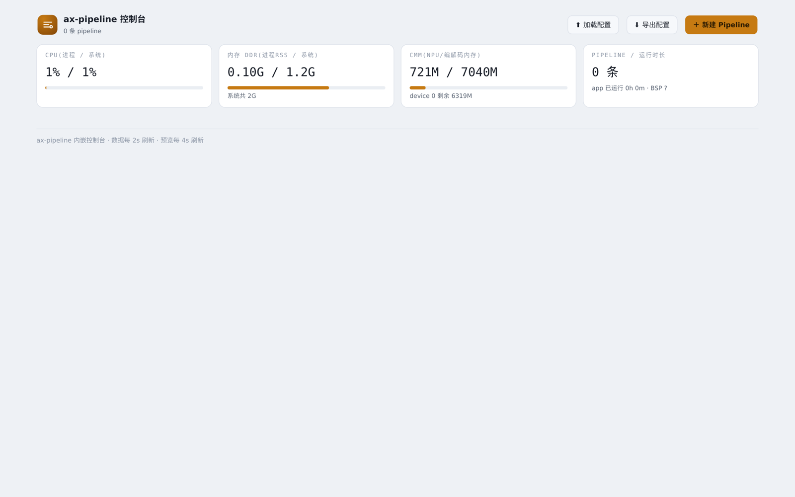
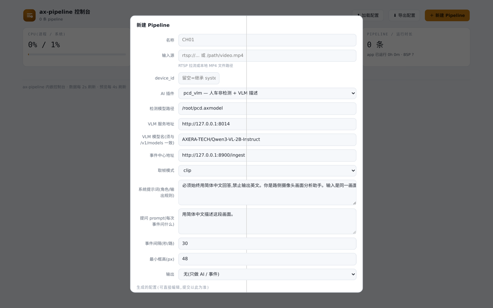
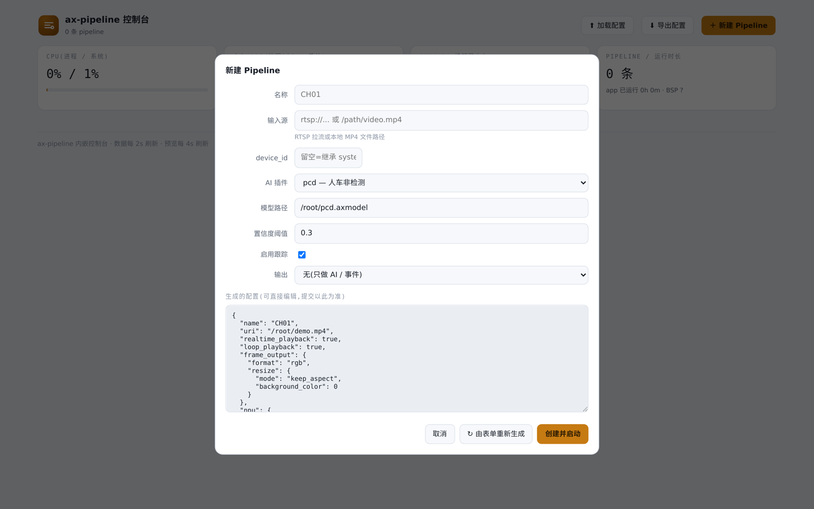
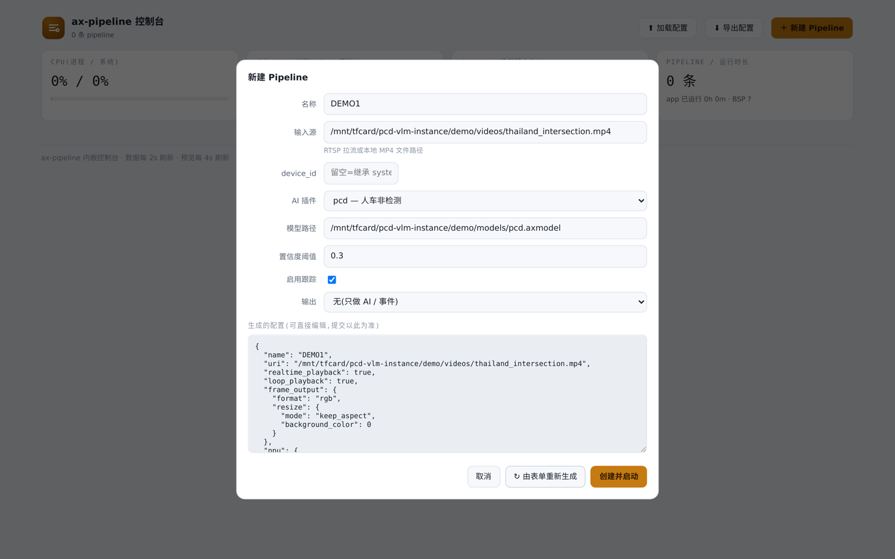
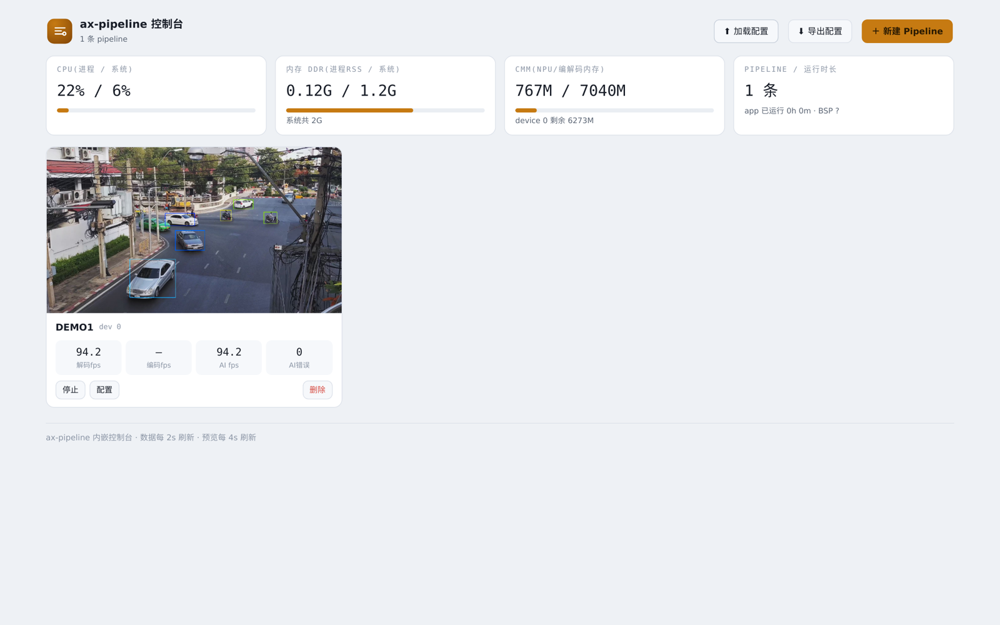

# 内嵌控制台(Web Console)使用指南

`ax_pipeline_app` 内嵌了一个网页控制台:不依赖任何外部 web 服务,从浏览器就能**增删改查 pipeline、看每路的解码/编码/AI 帧率、看 CPU/DDR/CMM 占用、点开任意一路看带检测框的实时画面**。

页面在编译期打进二进制(`cmake -DAXP_ENABLE_WEBUI=ON`,默认开启;实时预览对应 `AXP_ENABLE_PREVIEW`)。没人打开网页时控制台零开销——快照和直播的 JPEG 编码都是请求驱动的,没有观看者就不会发生。

## 启动

控制台随 app 启动,加 `--http_port` 即可。配置文件里的 `pipelines` 可以是空数组——完全从网页添加:

```bash
# 最小配置:{"system":{},"pipelines":[]}
./ax_pipeline_app -c empty.json -t 0 --http_port 8901 --http_addr 0.0.0.0
```

浏览器打开 `http://<设备IP>:8901/`:



顶部四张系统卡实时刷新(2 秒一轮):**CPU**(本进程 / 全系统)、**DDR**(进程 RSS / 系统)、**CMM**(NPU/编解码专用内存,AXCL 下按卡显示剩余)、**pipeline 数量与运行时长**(BSP 版本也显示在这里,与编译版本不一致时会标黄提醒)。

## 新建 Pipeline

点右上角「＋ 新建 Pipeline」:



- **名称**:留空自动编号(CH01、CH02…)
- **输入源**:RTSP 拉流地址(`rtsp://...`)或设备上的 MP4 文件路径
- **device_id**:AXCL 多卡时指定;留空继承配置文件里 `system.device_id`

## 选择 AI 插件——配置项自动从插件获取

「AI 插件」下拉列出设备上扫描到的所有插件。**每个插件的配置表单不是写死在网页里的,而是插件自己描述的**:插件 so 可导出

```c
const char* ax_plugin_get_config_schema(void);
```

返回一段 JSON(字段名、中文标签、类型、默认值),控制台据此自动生成表单。换一个插件,下面的表单立刻变成那个插件的配置项:



上图选择了 `pcd`(人车非检测),表单自动出现「检测模型路径 / 置信度阈值 / 启用跟踪」——这些都来自 pcd 插件的 schema。没有导出 schema 的插件也能用,直接在底部的 JSON 里手写 `npu.ax_plugin_init_info`。

填好名称、输入源和模型路径后,底部「生成的配置」会同步更新——**这段 JSON 才是最终提交的内容**,可以直接手改(表单没覆盖到的高级字段在这里加),提交以它为准:



## 运行与监控

点「创建并启动」,卡片立即出现,几秒后快照就绪(4 秒一刷,叠加检测框):


卡片四个数字:**解码 fps / 编码 fps / AI fps / AI 错误**。解码 fps 掉了先查输入源;AI fps 低于解码 fps 是正常的(受 `npu_max_fps` 限速);AI 错误非 0 时查 app 日志。

## 实时直播

点卡片的预览图,进入该路的实时检测画面(MJPEG,带每目标一色的跟踪框):


直播也是按需的:页面关掉,这路的 JPEG 编码立即停止。同一路可多人同时观看。

## 修改 / 停止 / 删除

卡片下的「配置」会**回读该路的真实运行配置**进弹窗,改完提交即热重建该路;「停止 / 启动」控制单路;「删除」移除:



## 导出 / 加载配置

网页上的增删改都作用于**运行中的 app**,不会写回启动用的 `-c` 配置文件。在网页上配好一套后,点头部的「**⬇ 导出配置**」即可把当前整套配置(`system` + 全部 `pipelines`)下载为一个完整 JSON,之后两种用法:

- **命令行直接启动**:`./ax_pipeline_app -c ax_pipeline_config.json -t 0 --http_port 8901`——导出文件就是标准配置格式,开机即恢复整套 pipeline;
- **网页上加载**:点「**⬆ 加载配置**」选择该文件,逐路立即生效——同名 pipeline 替换、新名字添加(`system` 段只在 `-c` 启动时生效,运行时加载会忽略它)。

对应的 HTTP 接口:`GET /api/v1/config/export` / `POST /api/v1/config/import`,可用于脚本化备份与批量下发。

## 插件 so 的放置

控制台扫描两种目录布局(命中一种为准),工作目录为 app 的启动目录:

```
plugins/<name>/libax_plugin_<name>.so    # 源码树 / 开发布局
lib/plugins/libax_plugin_<name>.so       # 交付包 / 部署布局(平铺)
```

自己写的插件放进任一布局即可被发现;实现 `ax_plugin_get_config_schema()`(可选)就能在网页上获得专属配置表单。插件 ABI 见 `include/ax_plugin/ax_plugin.h`,schema 写法可参考任意内置插件(如 `plugins/pcd.axera/plugin_pcd.cpp` 结尾)。

## 相关

- HTTP API(控制台背后的接口,可脚本化调用):`docs/http_api.md`
- 编译开关与部署:`docs/build.md`
- 检测 + VLM 语义播报的完整方案(事件中心网页):`plugins/pcd_vlm/README.md`
