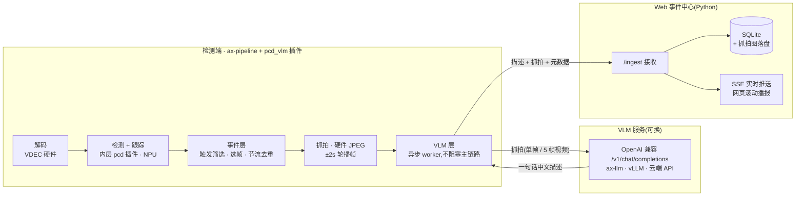
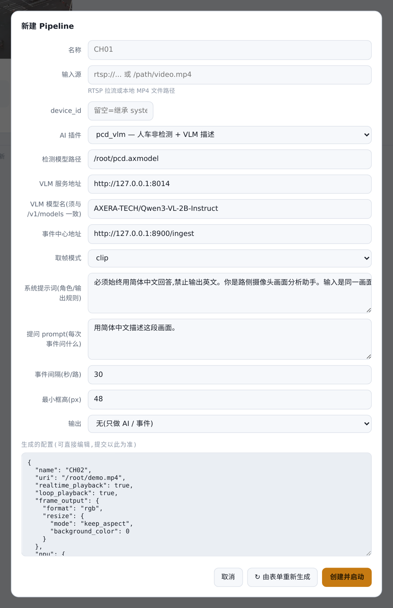
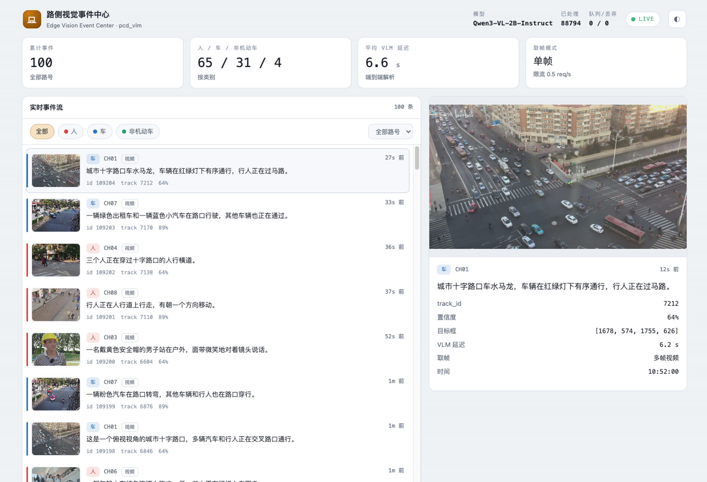

# pcd_vlm —— 检测触发 VLM 语义描述插件(demo,面向二次改造)

在 ax-pipeline 里,用便宜的检测器(默认 pcd 人车非)当"触发器",只在出现值得关注的目标时,
把那一刻的抓拍异步送给 **VLM**(视觉大模型)生成一句中文描述,汇总到网页事件中心实时展示 / 留档。



- **检测归检测,VLM 走异步旁路**:VLM 再慢也不阻塞解码/编码/OSD(infer 只做判定+入队,满即丢)。
- **部署组合任意**:检测端(AXCL 卡 / AX650 板端)× VLM 端(AXCL / AX650 / GPU-vLLM / 云端 API),
  `axcl+axcl`、`axcl+ax650`、`ax650+ax650`、`+云端` 都行,同机或分机。
- **这是一个 demo,专为二次改造设计**:三层解耦,想换哪层换哪层,见「四、架构与改造指南」。

---

## 一、目录结构

```
plugins/pcd_vlm/
├── plugin_pcd_vlm.cpp     # ABI 入口:组装三层(改造时一般不用动)
├── detector_proxy.hpp     # ① 检测/跟踪层:dlopen 现成检测插件转发
├── event_gate.hpp         # ② 事件层:触发/选帧/节流抖动/去重/硬件JPEG抓拍 → Event
├── vlm_worker.hpp         # ③ VLM层:异步worker,调VLM + 上报web
├── CMakeLists.txt
├── pcd_vlm.json           # 单路配置示例(无视频输出,产出即事件)
├── README.md
└── web/                   # 网页事件中心(Python FastAPI)
    ├── server.py          # /ingest 接收 → SQLite+抓拍落盘 → SSE + 页面
    ├── static/index.html  # 展示页(实时事件流/筛选/详情)
    ├── feed_demo.py       # 模拟检测的演示 feeder(不用板卡也能看效果)
    └── requirements.txt   # fastapi / uvicorn / httpx
```

## 二、快速开始

### 1) 起 VLM 服务(三选一)

**A. 边缘卡 ax-llm(推荐,单卡低成本)**
```bash
AXLLM_DEVICES=7 axllm serve <Qwen3-VL-2B模型目录> --port 8014
# 板端: axllm serve <模型目录> --port 8014
```
日志会打印 `Max concurrency: 1`(单卡串行,不会并行乱推)与 `POST /v1/chat/completions`。

**B. GPU 上的 vLLM**:`vllm serve Qwen/Qwen2.5-VL-7B-Instruct --port 8014`

**C. 云端付费 API**:`url` 指向服务商 OpenAI 兼容端点,填 `api_key`、`model`(如 `gpt-4o`)。

### 1.5) 内嵌控制台(app 自带,推荐先打开)

在控制台新建 pipeline、选择 `pcd_vlm` 插件后,表单会自动列出 VLM 服务地址、模型名、
事件中心地址、取帧模式,以及**两个提示词输入框**(系统提示词 / 每次事件的提问),
播报的语气和内容直接在网页上改,不用碰配置文件:



事件产出后,事件中心网页(:8900)实时滚动播报——左侧事件流(缩略图会循环播放 ±2s
轮播帧),右侧详情大图 + track/置信度/目标框/VLM 延迟:



控制台的通用用法(新建/监控/直播/编辑)见 `docs/webui.md`(仓库根目录 docs)。

`ax_pipeline_app` 编译时把一个 **web 控制台嵌进二进制**(HTML 是独立源文件
`src/app/webui/index.html`,CMake 构建时转成字节数组链入),加参数即可启用:

```bash
./ax_pipeline_app -c xxx.json --http_port 8901 --http_addr 0.0.0.0
# 浏览器打开 http://<IP>:8901 ;app 可以零 pipeline 启动,全部在网页上配
```

**功能一览**
- **Pipeline 管理**:表单新建(RTSP/MP4 源 → 插件下拉 → 关键字段 → 可手改的完整 JSON)/
  启停 / 删除 / 配置回读编辑。插件下拉与表单由各插件导出的 **config schema 动态生成**
  (`GET /api/v1/plugins`),加新插件网页零改动。
- **每路卡片**:解码/编码/AI 帧率(差分)、AI 错误数、带检测框的快照(640宽,4s 轮询);
  竖屏流按真实比例瀑布流排布。
- **点开卡片 → MJPEG 实时直播**:默认 1280 宽等比缩放(**不是原始分辨率**,
  `?max_w=` 可调)@10fps,叠加按 track 上色的检测框。
- **系统资源**:进程/系统 CPU、DDR、**CMM**(AXCL 按卡查 / 板端读 proc)、运行时长。

**性能与开销(实测)**
- **请求驱动、无人看零开销**:快照与直播都是收到 HTTP 请求才取最新帧→硬件 JPEG 编码,
  连接断开立即停止;没人打开网页时**一次 JPEG 都不会编**,无任何后台线程/定时器。
- 直播成本(打开时):每路 ~10 张/s 硬件 JPEG(单张几 ms)+ ~190KB/帧@1280宽 ≈ 12Mbps;
  8 路同时直播实测对解码/检测帧率**零影响**(A/B 压测,CPU 差 <1%)。
- 唯一被动成本:SDK 每路保留一个"最新帧"引用(`GetLatestFrame` 的既有机制,与网页无关)。

**编译开关**(默认都 ON,不需要可裁掉)
```bash
cmake -DAXP_ENABLE_WEBUI=OFF    # 去掉内嵌页面(GET / 404,二进制不含 HTML)
cmake -DAXP_ENABLE_PREVIEW=OFF  # 去掉 preview.jpg / stream.mjpeg 端点(HTTP API 本身保留)
```
快照与直播是同一取帧机制的两种消费速率,由 `AXP_ENABLE_PREVIEW` 一个开关统一管理。

**多路能力参考(NV12 零拷贝 + `npu_max_fps:10`,1080p30 + pcd 检测跟踪)**

| 平台 | 满帧路数与 CPU | 极限说明 |
|---|---|---|
| AXCL 单卡(x86 host) | 8路 16% / 16路 21% / **24路 43%,全满帧** | host CPU 富余,上限在卡内资源 |
| AX650 板端(8×A55) | 8路 18% / **16路 46%,全满帧** | 20 路起 VDEC 吞吐(~480fps@1080p)掉帧 |

改 UI 不想重编:`--http_webroot <目录>` 磁盘优先加载。

### 2) 起网页事件中心
```bash
cd plugins/pcd_vlm/web
pip install -r requirements.txt
PORT=8900 python3 server.py         # 打开 http://<本机IP>:8900
```

### 3) 跑 demo 交付包(推荐第一次这么跑)

拿到 `pcd_vlm_demo/` 交付包(结构如下)后,一行命令起 8 路:

```
pcd_vlm_demo/
├── run.sh                          # 一键启动脚本
├── config/pcd_vlm_8ch.template.json# 8路配置模板(路径占位自动替换)
├── models/pcd.axmodel              # 人车非检测模型(762KB)
└── videos/                         # 8条真实场景演示视频
    cross_road_aerial.mp4           # 俯拍十字路口车流
    zebra_crossing_aerial.mp4       # 俯拍斑马线人流
    construction_site_1.mp4         # 工地(脚手架/多工人)
    construction_site_2.mp4         # 工地(竖屏,安全帽工人)
    street_crossing_vertical.mp4    # 竖屏路口(行人/电动车)
    campus_walkway.mp4              # 校园林荫道(园区类)
    thailand_intersection.mp4       # 泰国路口
    pedestrian_street.mp4           # 行人街景
```

```bash
./run.sh <ax-pipeline构建目录>      # 例: ./run.sh ~/ax-pipeline/build_axcl
```
前置:第 1)、2) 步的 VLM 与 web 已起。打开 web 页面即可看到 8 路事件实时刷新。

### 4) 或者手写配置跑单路

参考 `pcd_vlm.json`(字段见「五、配置项」),要点:
- `npu.ax_plugin_path` → `libax_plugin_pcd_vlm.so`;
- `ax_plugin_init_info.pcd_plugin_path` → 内层检测插件(默认 `libax_plugin_pcd.so`);
- `vlm.url` → VLM 服务;`vlm.report_url` → web 的 `/ingest`;
- 每路配不同的 `stream_name`(CH01/CH02…)。

### 不用板卡先看效果(演示 feeder)
```bash
cd plugins/pcd_vlm/web
python3 feed_demo.py --ingest http://127.0.0.1:8900/ingest --frames_dir <图目录> --streams 4
# 只发图不带描述时,web 会用 VLM_URL 自动补调 VLM
```

---

## 三、(重要)多卡 AXCL 注意

- config 只在 `system` 写 `device_id` 时,老版本框架传给插件的是 `-1`(插件会落到卡0),
  而 VDEC/IVPS 在 system 卡上 —— **跨卡读内存,检测恒为 0**(症状极具迷惑性)。
  已在 `config_loader` 修复:pipeline 未写 `device_id` 时自动继承 `system.device_id`。
  保险起见,多卡部署时建议 pipeline 级显式写 `device_id`。
- 检测端与 VLM 端用不同的卡(如检测卡6、VLM 卡7),互不抢算力。

### 板端(AX650 on-chip)路数与 CPU 实测(8×A55,1080p30 + pcd 检测跟踪)

| 配置 | 8路 | 12路 | 16路 |
|---|---|---|---|
| 不限检测帧率 | 86% CPU | — | — |
| **`npu_max_fps:10`(推荐)** | **43%** | **~69%** | 98%(仍全满帧但零余量) |

**三条调优铁律(板端/AXCL 通用,按收益排序):**
1. **`frame_output` 不要写 `format`(保持 NV12)**:写了 `"rgb"` 会让 SDK 每帧做「CMM 分配 + IVPS 全幅
   CSC(1080p NV12→RGB)」,插件里还要再缩放一次——全是浪费(模型只要 640×352)。不写 format 时
   回调**零拷贝直通解码帧**,插件内一次 IVPS 直接 NV12→模型输入。实测 8 路 CPU **43%→17.6%**。
2. **`npu_max_fps` 限检测帧率**:事件型应用 10fps 足够,8 路 CPU 86%→43%。
3. **不要指定 `frame_output` 宽高**:强制缩放同样走"处理+拷贝"路径(实测 8 路反涨到 97%)。

板端最终实测(两条优化叠加,1080p30 + pcd 检测跟踪):**8 路 CPU ~18%、16 路 ~46% 且全部满帧解码**;
20 路起解码掉帧 —— 瓶颈已从 CPU 转移到 VDEC 硬件吞吐(约 480fps@1080p),CPU 还剩一半余量。
多于 16 路需 `system.vdec_max_group_count` 配大(默认 16)且接受降帧,或用低帧率/低分辨率源。

---

## 四、架构与改造指南(demo 的正确打开方式)

三层各自独立,想改哪层只动一个文件:

### ① 检测/跟踪层 `detector_proxy.hpp`
装饰器模式:dlopen 一个**现成的**检测插件并完整转发(检测框照常给 OSD/主链路),
本插件不重复实现检测,内层插件升级即自动受益。
- **换检测器**:config 里把 `pcd_plugin_path` 指到别的插件(yolov5/yolov8/helmet…),
  同时把检测参数(`num_classes` 等)换成该插件的参数即可,本层代码零改动。
- 注:插件会强制给内层开 `enable_tracking`(事件层的去重/选帧需要 `track_id`)。
- **配置自描述**:插件可导出可选的 `ax_plugin_get_config_schema()`(返回 JSON:label + 完整默认 init_info + 重点字段说明),控制台 `GET /api/v1/plugins` 扫描后据此**动态生成新建表单**——加新插件或新配置项,网页零改动。本仓库全部插件已实现。

### ② 事件层 `event_gate.hpp`
把"每帧检测结果"过滤成稀疏「事件」(默认策略:新目标出现→挑最清晰一刻→抓拍一次)。
所有业务策略都在这一层,**想做禁区闯入 / 越线 / 停留超时 / 聚集检测,改这里**:
- 触发条件在 `Pass()`:加一个"框中心在多边形区域内"判断就是禁区检测;
- 选帧在 `OnFrame()` 的 best 逻辑;抓拍在 `Snapshot()`(整帧/ROI,硬件 JPEG,支持 device 帧);
- 内置防坑:每路节流 ±20% 抖动(防与循环视频时长共振)、连续相同抓拍去重、
  track 状态 10s 过期清理(长时间运行不膨胀)。

### ③ VLM 层 `vlm_worker.hpp`
独立线程消费事件:调 OpenAI 兼容 VLM(自带极简 HTTP/1.0 client,零外部依赖)→
把「描述+抓拍+元数据」POST 给 web `/ingest`。
- **换 VLM 后端**:改 config 的 `url/api_key/model` 即可(ax-llm / vLLM / 云端通吃);
- **换上报目标**(MQTT / 数据库 / 私有平台):改 `Report()` 一个函数;
- 队列满丢最旧、可选失败重试一次,永不阻塞主链路。

### web 事件中心 `web/`
纯展示,不参与调度(也支持"只收图、由 web 补调 VLM"的旁路模式,方便无板卡演示)。
事件只保留最近 **100** 条(env `MAX_EVENTS` 可调),超出的连抓拍/轮播图片文件一起滚动删除,长期运行不膨胀。
接口:`POST /ingest`、`GET /`(页面)、`GET /stream`(SSE)、`GET /api/events`、
`GET /api/stats`、`GET /img/{name}`。生产可 systemd 常驻或 pyinstaller 打单文件。

---

## 五、配置项(`npu.ax_plugin_init_info`)

检测字段(`model_path`/`num_classes`/`strides`/`conf_threshold`…)透传给内层检测插件。
本插件私有字段:

| 字段 | 默认 | 说明 |
|---|---|---|
| `pcd_plugin_path` | libax_plugin_pcd.so | 内层检测插件路径 |
| `stream_name` | CH00 | 本路路号(展示/区分用) |

### `vlm` 块

| 字段 | 默认 | 说明 |
|---|---|---|
| `enable` | true | 关掉=纯检测插件 |
| `url` | http://127.0.0.1:8013 | VLM 服务(OpenAI 兼容) |
| `api_key` | "" | 云端/vLLM 需要时填 |
| `model` | "" | **建议必填**:ax-llm serve 校验模型名,须与 `GET /v1/models` 的 id 完全一致(如 `AXERA-TECH/Qwen3-VL-2B-Instruct`),留空回退 `"vlm"` 会被拒 |
| `system_prompt` | … | 业务约束都写这里(场景/输出格式/字数/**强制中文**),见「八、prompt 附录」 |
| `prompt` | 用简体中文描述这张画面。 | 用户指令(保持简短) |
| `max_tokens` | 80 | 输出上限(60字两句 ≈ 80;30字一句 ≈ 48) |
| `temperature` | 0.7 | 采样温度 |
| `report_url` | http://127.0.0.1:8900/ingest | web 事件中心;留空=只调 VLM 不上报 |
| `crop_mode` | frame | `frame`=整帧送 VLM(上下文全,**推荐**;InternVL/Qwen 固定小分辨率输入,耗时与抠图相同);`roi`=抠检测框(远处小目标特写) |
| `roi_expand` | 0.0 | roi 模式按框比例四周外扩(0.5=每边扩50%) |
| `jpeg_quality` | 80 | 抓拍 JPEG 质量 |
| `motion_replay` | true | 事件附带 **±2s 共5帧**(每秒1帧,事件前2帧来自插件内预缓存环)——网页详情页 0.6s/帧循环轮播,点开"会动";关=只有主帧。VLM 仍只看主帧 |

### `vlm.trigger`(事件触发策略 —— 检测到 ≠ 一定送)

| 字段 | 默认 | 说明 |
|---|---|---|
| `classes` | [] | 只对这些类别触发(pcd: 0人/1车/2非机动车);空=全部 |
| `min_score` | 0.4 | 置信度门槛 |
| `min_box_h` | 64 | 框高(px)下限,太小看不清不送 |
| `min_track_age` | 8 | 连续跟踪≥N帧才算稳定目标(滤一闪而过) |
| `reject_border` | true | 贴边(残缺)不送 |
| `per_track_once` | true | 每个 track_id 只送一次(**最省吞吐**) |
| `per_track_cooldown_s` | 0 | >0 则长停留目标每 N 秒复看一次 |
| `select_frame` | best | best=框面积×置信度最高的目标;now=仅按置信度 |

### `vlm.rate`(节流 / 队列)

| 字段 | 默认 | 说明 |
|---|---|---|
| `per_stream_interval_s` | 30 | **每路最小事件间隔(主旋钮)**,实际带 ±20% 抖动 |
| `queue_size` | 4 | VLM 待处理队列,满丢最旧 |
| `retry_once` | false | VLM 失败/503 重试一次 |

---

## 六、模型选型与性能(真机实测,8卡 AX650/AXCL x86)

| 模型 | 单张耗时 | 说明 |
|---|---:|---|
| **Qwen3-VL-2B** ⭐推荐 | ~3.3s | 描述最细(动作/方位/穿着/装备都说得准),且唯一支持视频多帧 |
| InternVL3.5-1B | ~3.0s | 最快,但描述粗(常只说"一辆白色SUV"),只支持单帧 |
| InternVL3.5-2B | ~4.5s | 更慢,质量没更好 |
| FastVLM-1.5B / SmolVLM2 | — | 话太多 / 太弱,不推荐 |

- 模型获取(HF,国内可用 `hf-mirror.com`):`AXERA-TECH/Qwen3-VL-2B-Instruct`、
  `AXERA-TECH/InternVL3_5-1B_GPTQ_INT4`(选 **AX650** 版;AX620E 版在 AX650/AXCL 上会 `AXCLWorker exit`)。
  pcd 检测模型:`AXERA-TECH/Person_car-axera` 的 `ax_ax650_pcd_tiny_algo_rgb_nhwc_V2.0.0.axmodel`。
- **并发=串行**:ax-llm serve `Max concurrency: 1`,并发请求串行处理、内容正常;超限返回 503(本插件默认丢弃)。
- **事件延迟公式**(Qwen3-VL-2B 实测):`延迟 ≈ 1.5s(vision编码0.97s+prefill0.54s,固定) + 输出字数 ÷ 9.73 token/s`。30字描述 ≈ 4.5s,60字详细描述 ≈ 6~8s;两路同时触发时后到的还要加排队。**这是异步事件记录的正常成本**(主链路不受任何影响),想快就把描述缩到40字内(`max_tokens 56`)或多卡分流。

### 多少路 ↔ 间隔多大(单卡 VLM 串行,单张 ≈ 3~4s)

不堆积条件:**每路间隔 ≥ 单张耗时 × 路数**。8 路 → ≥30s;16 路 → ≥60s。
想更密:换更快模型 / 多卡多 serve 分担(各路 `url` 指不同卡)/ 接受队列丢弃(已默认)。

---

## 七、单帧 vs 视频多帧

| 模式 | 效果 | 说明 |
|---|---|---|
| **单帧**(当前实现) | 一句"此刻画面"描述 | 任意 VLM |
| 视频多帧(可扩展) | 一句"这段时间发生了什么" | 需 Qwen3-VL;`video:` 前缀多帧,token 次线性(5帧≈2.7×单帧),耗时只多 ~1.6s;2B 只能给概括性动态 |

web 的 `/ingest` 已支持 `frames:[b64,...]` 多帧格式(`CLIP_STYLE` 适配 ax-llm/云端);插件侧多帧采集留作改造点(事件层攒帧即可)。

---

## 八、prompt 附录(实测结论)

1. **详细 system prompt 几乎不加延迟**:ax-llm 有 prefix KV cache + prefill 按 chunk 批处理,
   VLM prefill 大头是图片 token —— 实测详细 system(381 tok)比简短(299 tok)**更快**(输出被引导得更收敛)。
   所以业务约束(场景说明/类别定义/输出格式/字数/示例)都塞 `system_prompt`,`prompt` 留一句话。
2. **强制中文**:小模型偶尔飘英文,system 开头写「必须始终用简体中文回答,禁止输出英文」可压住。
3. **禁止分点**:`max_tokens` 放宽后小模型爱列条目,system 里写「禁止分点、列表、标题」。
4. 推荐模板(交付包 config 同款):
   > 必须始终用简体中文回答,禁止输出英文。你是路口视频画面分析助手,画面来自固定路侧摄像头。
   > 请用一段话(两句以内、不超过60个字)描述画面:先说最主要的车辆或行人(类型、颜色、正在做什么),
   > 再简述周围目标和交通状况;看不清的不要编造,禁止分点、列表、标题。

---

## 九、平台说明与已知坑

- **本场景不需要 `outputs`**:产出就是「事件+抓拍+描述」,去掉 outputs(和 `enable_osd`)可省 VENC 通道;如需带框视频流再加回 `outputs` + `enable_osd:true`。
- **但 `system.enable_venc` 必须保留 `true`**:抓拍的硬件 JPEG 编码也走 VENC 模块,关掉会报 `AX_VENC_JpegEncodeOneFrame 0x8007020a`、事件全无。
- 抓拍用 **ax-video-sdk 硬件 JPEG**(`ImageProcessor` 裁剪 + `EncodeJpegToBase64`),
  直接吃卡上的帧,**AX650 板端(CMM)与 AXCL(device 帧)都支持**,无需 CPU 读像素。
- `ax_plugin_isolation` 用 `inproc` 或 `subprocess` 都可(每路独立、无跨路共享状态)。
- 循环播放 demo 的坑:事件间隔若与视频时长成整数倍,每次触发落在**同一帧**,该路抓拍永远一张图。
  插件已内置:间隔 ±20% 抖动 + 连续相同抓拍跳过(真实相机流不受影响)。
- 演示素材若来自网络(如 B 站 `yt-dlp` 下载),注意编码:**VDEC 只支持 H.264/H.265,AV1 要先
  `ffmpeg -c:v libx264` 转码**,否则 pipeline Open 失败。
- web 时间显示异常("几万小时前")= 上报的 `ts` 不是 epoch 秒;插件已用墙钟,web 也有兜底。
